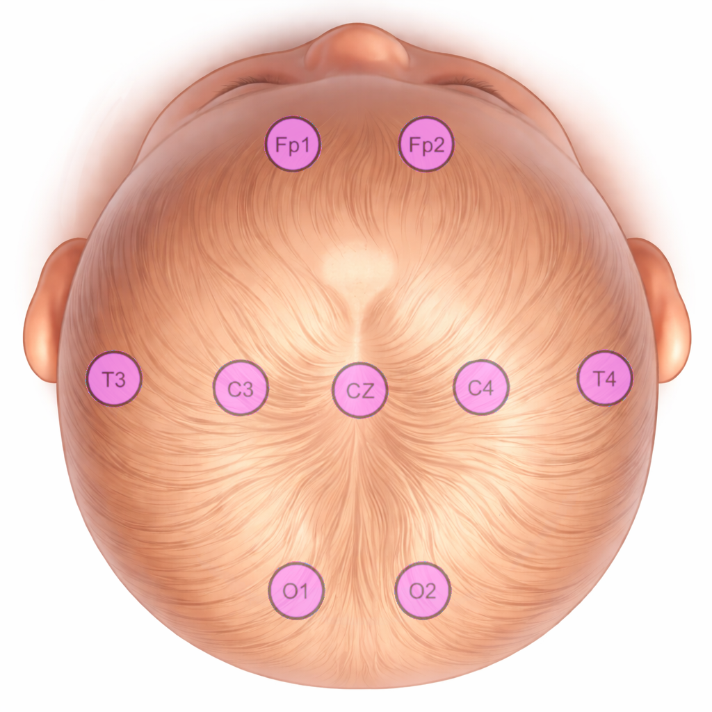

# DIRU: Dendrite-Inspired Recurrent Units for Learning Chaotic Dynamics and Neonatal Epilepsy Time Series

This package contains a complete implementation of a novel RNN architecture inspired by dendritic computation in biological neurons, along with comprehensive comparisons to LSTM.


<p align="center">
  
</p> 

 
## 🎯 Key Innovation
- Multiple dendritic compartments for parallel local computation
- Per-compartment gating (like voltage-gated ion channels)
- Somatic integration of compartment outputs
- Global modulation mechanisms

 
## 📄 License & Citation

**License**: MIT - Free to use and modify

**Citation**: If you use this code, please cite:
```bibtex
@misc{diru2025,
  title={DIRU: Dendrite-Inspired Recurrent Units for Learning Chaotic Dynamics and Neonatal Epilepsy Time Series},
  authors={Alessandro Crimi, Cris Micheli, Tiziana Currieri, Francesco Prinzi,Salvatore Vitabile },
  year={2026},
  volume ={38},
  issue = {778},
  Journal={Neural Computation and Application}
}
```
https://doi.org/10.1007/s00521-026-12526-w
  

**Version**: 1.0.0
**Date**: August 2025
**Status**: Research Prototype
**Dependencies**: PyTorch 1.9+, NumPy, Matplotlib

**Ready to explore dendritic computation in deep learning! 🧠✨**
